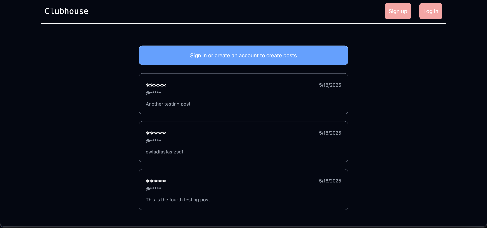

# Clubhouse

A clubhouse where registered users can create a post.



## Information

Viewing without an account will not provide the author and the post title. Creating an account and logging in will allow you to view such information, as well as create a post.

## Tools Used

- React + Vite
- Tailwind CSS
- HTML5
- TypeScript
- Node.js
- Express.js
- PostgreSQL

## Getting Started

```
git clone https://github.com/AndrewC145/Clubhouse.git

cd Clubhouse

cd client
cd server

npm install

npm run dev
```
